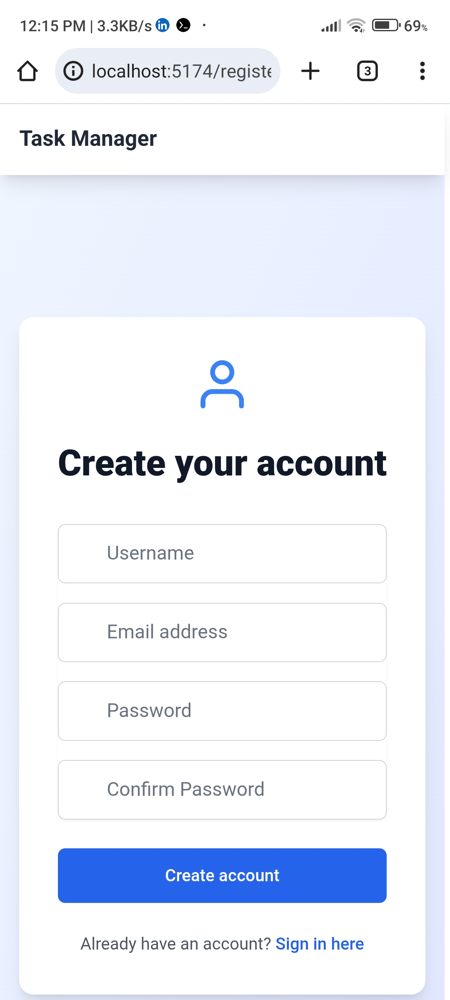

# 📌 Task Manager

A simple and responsive **Task Manager application** built with **React.js (frontend)** and **Node.js/Express (backend)**.  
This app allows users to **register, log in, and manage daily tasks with priorities**.

---

## 🚀 Features
- ✅ User Authentication (Register, Login, Logout)  
- ✅ Secure password hashing with JWT authentication  
- ✅ Add, Edit, Delete, and Mark tasks as complete  
- ✅ Set priority (Low / Medium / High) for tasks  
- ✅ Responsive UI for desktop and mobile  
- ✅ Persistent storage with MongoDB  

---

## 🛠️ Tech Stack
**Frontend:**  
- React.js (Vite / CRA)  
- Axios (API requests)  
- Tailwind CSS (styling)  

**Backend:**  
- Node.js  
- Express.js  
- MongoDB + Mongoose  
- JWT for authentication  

---

## 📸 Screenshots

### 🔹 Register


### 🔹 Login


### 🔹 Dashboard


---

## ⚙️ Installation & Setup

### 🔑 Prerequisites
- [Node.js](https://nodejs.org/) (v16 or higher)  
- [MongoDB](https://www.mongodb.com/) (local or MongoDB Atlas)  

### 🔧 Steps
1. **Clone Repository**
   ```bash
   git clone https://github.com/your-username/task-manager.git
   cd task-manager
